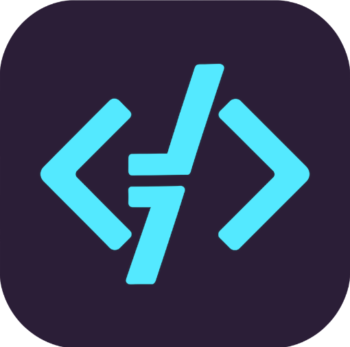
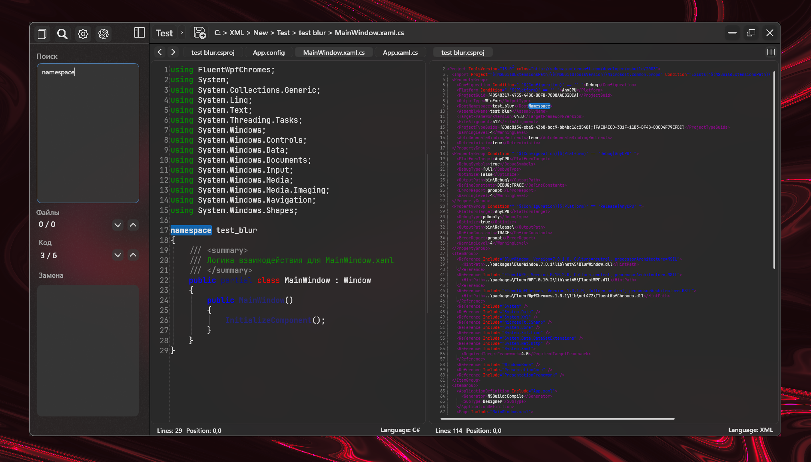
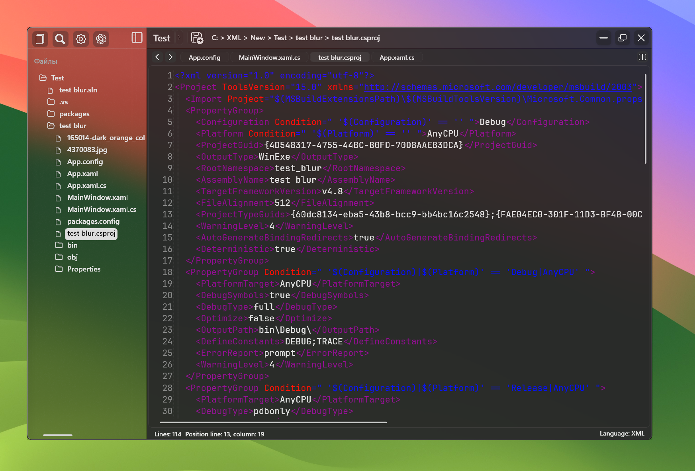
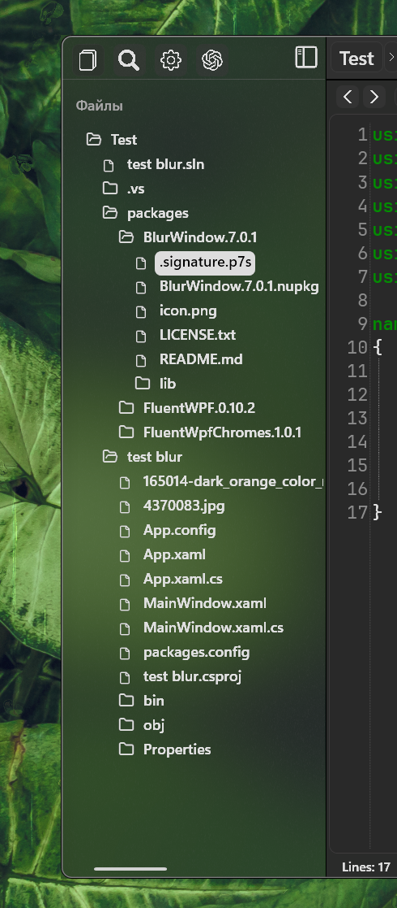

  
   
   
  
   
   
   
   
   
   

 

  <strong>Code Editor</strong> is a modern and convenient code editor that combines <strong>minimalism, speed, and smart features</strong>.  
  With it, you can comfortably write in C#, Python, JavaScript, and other languages while enjoying a stylish Fluent-inspired design and built-in AI autocompletion (BETA).  
  
  👉 Lightweight, fast, and flexible — my editor is made for those who value simplicity and beauty in their workflow.  

   

## ✨ Key Features  

- 📂 **Open and edit files** — supports folders and standalone files.  
- 🎨 **Syntax highlighting** for C#, HTML, CSS, XML, Python, JavaScript, and more.  
- 🗂 **Tabbed interface** with scrolling when tabs overflow.  
- 🔍 **Search and replace** across files, folders, and code.  
- ⚡ **Customizable themes and plugins** for personalization.  
- 📜 **History and undo** for code changes.  
- 🤖 **Local and AI-based autocompletion** (Beta).  
- 🖥️ **Flexible UI** with acrylic effects and Fluent icons.  

  

## 🎨 Design & Interface  

I focused on **minimalism and aesthetics**:  
- 🌑 Dark theme to reduce eye strain.  
- 🪟 Acrylic transparency in panels.  
- 🖋 Crisp Fluent icons.  
- 🎯 Intuitive panel and tab layout.  
- ✨ Smooth accents and element highlights.  

 

<table>
  <tr>
    <td style="width: 300px; vertical-align: top; padding-right: 20px;">
      
    </td>
    <td style="vertical-align: top; padding-left: 10px; font-size: 16px; line-height: 1.5;">
      <strong>Clear Project Explorer</strong> — The left panel shows a structured and expandable file tree, making navigation across project files and folders intuitive. It supports multiple levels of nested directories.   
      <em>Benefits:</em>
      <ul>
        <li>Expandable folders for better organization</li>
        <li>Quick file search</li>
        <li>Supports nested directories</li>
      </ul>
    </td>
  </tr>
</table>

---

- [x] Syntax highlighting  
- [x] Tabbed mode  
- [ ] Plugins  
- [ ] Linux and macOS support  
- [ ] Full AI assistant  

---

## Why Code Editor is Better  

| Feature               | Code Editor ✅ | VS Code ⚪ | Notepad++ ⚪ |
|-----------------------|----------------|------------|--------------|
| Simple interface      | ✅             | ⚪         | ⚪            |
| Minimal dependencies  | ✅             | ⚪         | ✅            |
| Fluent design         | ✅             | ⚪         | ⚪            |

---

## 📥 Installation  

### Requirements  
- Windows 7+  
- .NET Framework 4.8  
- Microsoft Edge WebView2 Runtime (for future web preview)  

### Instructions  
1. Download the [latest release](https://github.com/atocheniy/Code-Editor/releases).  
2. Extract the archive.  
3. Run `CodeEditor.exe`.  
4. Open a project or create a new file.  

---

## 🛠 Usage  

- **Editing** — tabs, highlighting, history.  
- **Search & Replace** — powerful project-wide search.  
- **Customization** — themes and plugins.  
- **Flexibility** — move and hide panels as needed.  

---

## 📚 Supported Languages  

C#, HTML, CSS, XML, Python, JavaScript, and many more!  

---

## 🧩 Extensions  

- 🎨 Themes (light and dark).  
- 🤖 AI autocompletion (Beta, requires API).  

---

## ⚙️ Technologies  

- ICSharpCode.AvalonEdit  
- FluentWPF  
- Xceed.Wpf.Toolkit  
- Microsoft.CodeAnalysis  

---

## Contributing
Contributions are welcome! If you’d like to add new features, fix bugs, or improve documentation, please reach out using my contact info.   

## 📬 Contact
- **GitHub Issues**: [https://github.com/atocheniy/Code-Editor/issues](https://github.com/atocheniy/Code-Editor/issues)  
- **Email**: atochony@gmail.com  

Thanks to the open-source community and library developers who made Code Editor possible!

